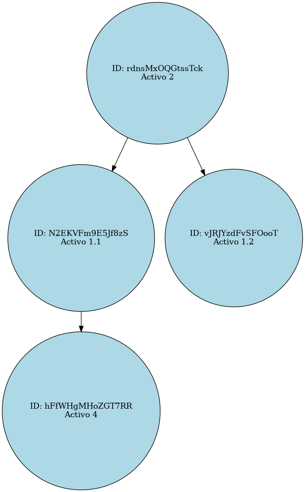

# Manual de Usuario
### Gestor de activos
#### Jorge Mejía - Carné 202300376

## Introducción

El gestor de activos es una aplicación que permite llevar un control de los activos de una empresa, y de un departamento permitiendo agregar, modificar y eliminar activos, así como también visualizar los activos existentes.

El sistema está desarrollado en C++, es un programa en consola que permite al usuario interactuar con el sistema mediante un menú de opciones.

## Requerimientos

Para poder ejecutar el programa se necesita tener instalado un compilador de C++ en la computadora, como por ejemplo g++, y tener acceso a una terminal de comandos.

#### Compilación

Para compilar el programa, ejecute el siguiente comando en la terminal:
```
g++ -o main main.cpp
```

#### Ejecutar el programa

El programa debe ser compilado y ejecutado en una terminal de comandos.

Sin embargo, se puede ejecutar el programa en un entorno de desarrollo como Visual Studio Code, Code::Blocks, Dev C++, etc.

A su vez, el repositorio cuenta con el archivo `ejecutar.txt` que contiene los comandos necesarios para compilar y ejecutar el programa en una terminal de comandos.

Incluye el archivo `main` que es el ejecutable del programa.

```
./main
```

## Inicio de sesión


```
-------------------- Iniciar sesión --------------------
Ingrese el usuario: admin
Ingrese la contraseña: admin
Ingrese la empresa: 
Ingrese el departamento: 
--------------------------------------------------------
```

El programa inicia solicitando al usuario que ingrese su usuario y contraseña, y posteriormente la empresa y departamento al que pertenece. El usuario admin es el único usuario registrado en el sistema, para ingresar al sistema se debe ingresar el usuario y contraseña admin, y posteriormente la empresa y departamento, los cuales son campos vacíos.

## Menú de opciones - Usuario

Para ingresar al menú de opciones del usuario, el administrador debe crear un usuario en el sistema. Un usuario cuenta con un nombre, apellido, usuario, contraseña, empresa y departamento.

```
--------------------- Menu Usuario ---------------------
1. Agregar Activo
2. Eliminar Activo
3. Modificar Activo
4. Rentar Activo
5. Activos Rentados por mi
6. Mis Activos Rentados
7. Devolver activo
8. Cerrar Sesión
--------------------------------------------------------
```

El menú de opciones del usuario permite realizar las siguientes acciones:

1. Agregar Activo

El usuario puede agregar un activo al sistema, ingresando el nombre y la descripción del activo.


1. Eliminar activo
2. Modificar Activo
3. Rentar Activo
4. Activos Rentados por mi
5. Mis Activos Rentados
6. Devolver activo
7. Cerrar Sesión

El activo será capaz de rentar un activo, visualizar los activos rentados por él, visualizar los activos que ha rentado, y devolver un activo rentado.
Todo esto se hace por medio de un id alfanumérico que identifica a cada activo.


## Menú de opciones - Administrador

```
------------------ Menu Administrador ------------------
1. Registrar Usuario
2. Reporte Matriz Dispersa
3. Reporte Activos Disponibles de un Departamento
4. Reporte Activos Disponibles de una Empresa
5. Reporte Transacciones
6. Reporte activos de un usuario
7. Activos rentados por un usuario
8. Ordenar transacciones
9. Salir
--------------------------------------------------------
```

El menú de opciones del administrador permite realizar las siguientes acciones:

1. Registrar Usuario
2. Reporte Matriz Dispersa
3. Reporte Activos Disponibles de un Departamento
4. Reporte Activos Disponibles de una Empresa
5. Reporte Transacciones
6. Reporte activos de un usuario
7. Activos rentados por un usuario
8. Ordenar transacciones
9. Salir

El administrador será capaz de registrar un usuario, visualizar la matriz dispersa de activos, visualizar los activos disponibles de un departamento, visualizar los activos disponibles de una empresa, visualizar las transacciones realizadas, visualizar los activos de un usuario, visualizar los activos rentados por un usuario.

Los reportes son generados y almacenados en archivos `.png` en la carpeta `reportes/`.

## Estructura de datos

Las estructuras de datos utilizadas en el sistema son las siguientes:

- Lista doblemente enlazada
- Matriz dispersa
- Árbol binario de búsqueda

Los reportes generados coinciden con estas estructuras de datos, se encuentran ejemplos de reportes en la carpeta `examples/`.




